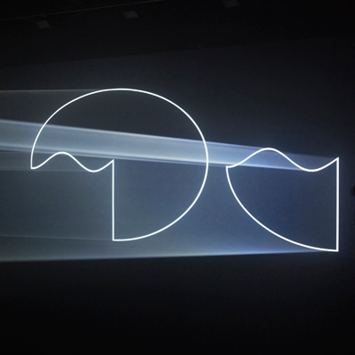
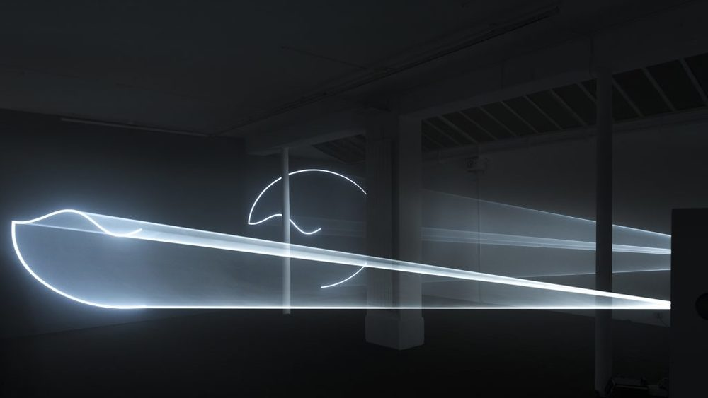
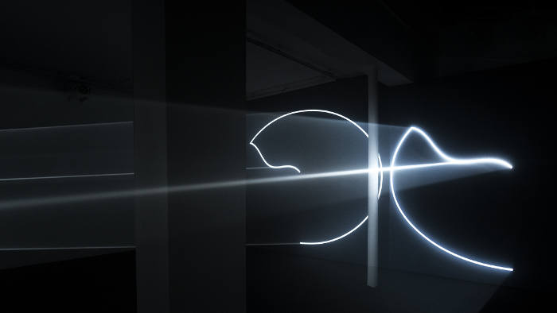
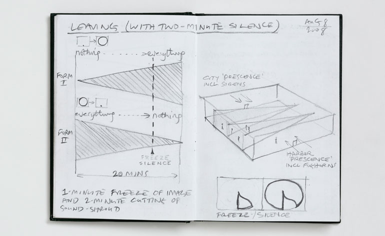
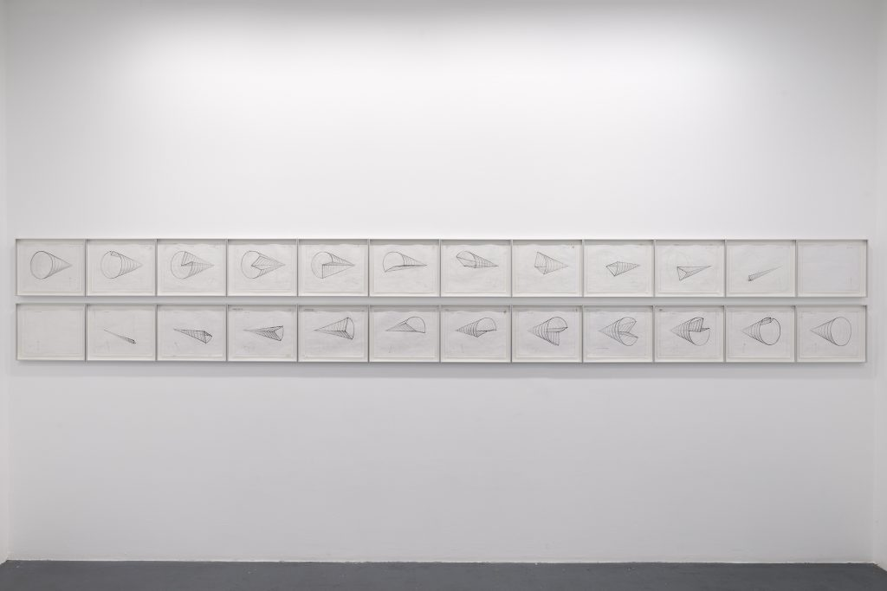

## Description

I visited the [The Hepworth Wakefield](https://hepworthwakefield.org/) recently and was captivated
by a work called _Leaving (With Two-Minute Silence)_ which was part of the "Anthony McCall: Solid Light Works" exhibition (16 Feb - 3 June 2018). I thought it would be interesting to try to re-create the effect using JavaScript and three.js.

## Hints

* [Anthony McCall - Lecture: "Recent Work and Current Projects"](https://www.youtube.com/watch?v=HvuqdpsmS-s)
    * 21:00 - 26:50

Bits of descrption garnered from the above video:    

* double horizontal work
* clock wipe
* the image gets brought in in this circular manner
* the idea of a form that begins as a complete cone of light, but through the agency of a wedge, is gradually cut into until there is nothing left at the end of a, say, 30 minute period
* the idea of the clock wipe working in coordination with the expanding wedge
* a circle, a straight line and then a travelling wave, forming one single line
* as the wedge expands into the form, the whole form is itself rotating so you get a kind of a twisting action through space and through time
* two cones of light - they move in opposite directions
* left is going from everything to nothing while the right hand one is going from nothing to everything and they are both going through this twisting motion

## Photos of the work (from the internet)

  

  

  

  

  

  

### Photos of working drawings by the artist (from the internet)

  

  

  

## Keyboard controls

* a
  * toggle axes helper
    * x-axis: red, y-axis: green, z-axis: blue
* f
  * cycle through installations
* m
  * toggle mode: 2D/3D
* p
  * cycle through camera positions (3D mode only)
* r
  * toggle autorotate    
* v
  * toggle vertex normals helper for the membranes

See also:

* [OrbitControls.keys](https://threejs.org/docs/index.html#examples/controls/OrbitControls.keys)
* [OrbitControls.mouseButtons](https://threejs.org/docs/index.html#examples/controls/OrbitControls.mouseButtons)

## TODO

* [x] Create basic project structure
* [x] Add simple ellipses
* [x] Add basic animation of the ellipses
* [x] Add simple "clock-hands"
* [x] Add basic animation of the "clock-hands"
* [x] Combine the ellipses and the "clock-hands"
* [x] Try to re-create the exact movement of the ellipses (sinusoidal ?)
    * [x] loci of the starting points of the ellipses
        * _the starting point of an ellipse is also the starting point of the corresponding "clock-hand" Bézier curve (see below)_
    * [x] get the speed right
* [ ] Try to re-create the exact movement of the "clock-hands" (Bézier curves ?)
    * [ ] loci of the ending points
    * [ ] loci of the control points
    * [ ] get the speed right
* [x] Add the opposite form
* [x] Try to re-create the membrane effect
* [ ] Improve the membrane effect (highlights)
* [x] Deploy to gh-pages branch

## Links

* [Anthony McCall - Wikipedia](https://en.wikipedia.org/wiki/Anthony_McCall)
* [Anthony McCall: Solid Light Works at The Hepworth Wakefield](https://www.youtube.com/watch?v=86rUPcMZ2dU)
* [Anthony-McCall-Solid-Light-Works-Image-sheet.pdf](https://s3-eu-west-1.amazonaws.com/hepworth-wakefield-live/wp-content/uploads/2017/11/08095925/Anthony-McCall-Solid-Light-Works-Image-sheet.pdf)
* [Anthony McCall - Lecture: "Recent Work and Current Projects"](https://www.youtube.com/watch?v=HvuqdpsmS-s)
    * 21:00 - 26:50
* [Anthony McCall - 'Solid Light, Dark Rooms'](https://www.youtube.com/watch?v=ufDO2EGtMmE)
